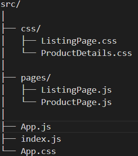
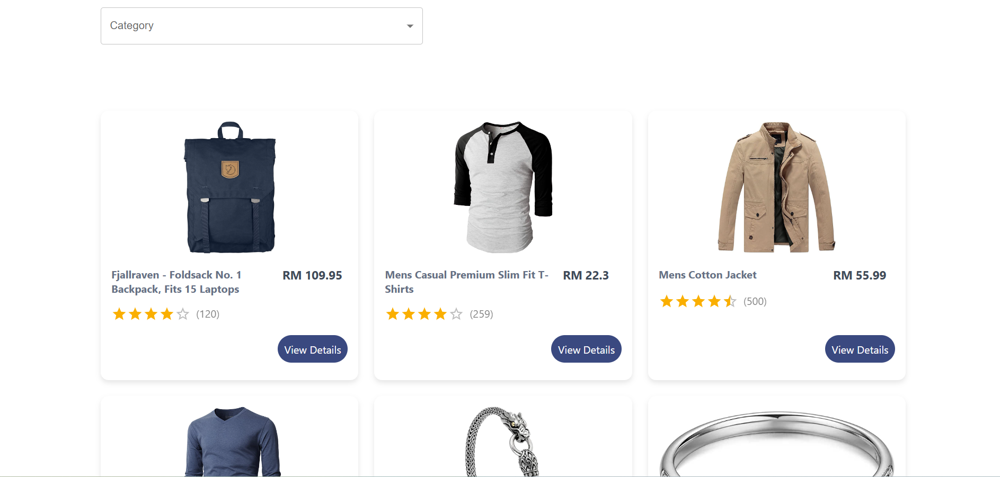
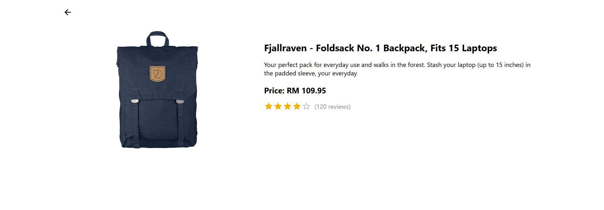
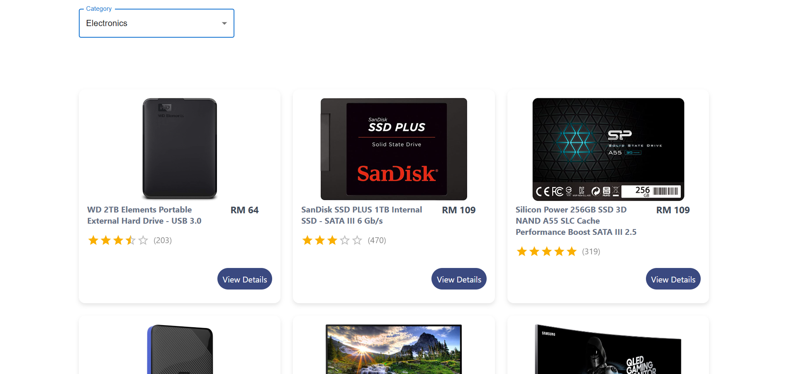

# Getting Started with Create React App

This project was created with [Create React App](https://github.com/facebook/create-react-app).

# E-commerce App

This is a simple React-based e-commerce application that displays a list of products and their details.

## Features
- Product listing with categories
- Product details page
- Responsive design

## Technologies Used
- React
- React Router
- Fetch API

## Folder Structure

## Screenshot
1. Product Listing Page:

2. Product Details Page:

3. Filter Product Based On Category:

## How to Run
1. Clone the repository: https://github.com/Xiang031226/ecommerce-website.git
2. Open the terminal and make sure you are in the project directory, then install the dependencies:
   ### `npm install`
3. Run the app
   ### `npm start`

Ctrl + Click the URL provided to view it in your browser, it will look something like this [http://localhost:3001](http://localhost:3000)